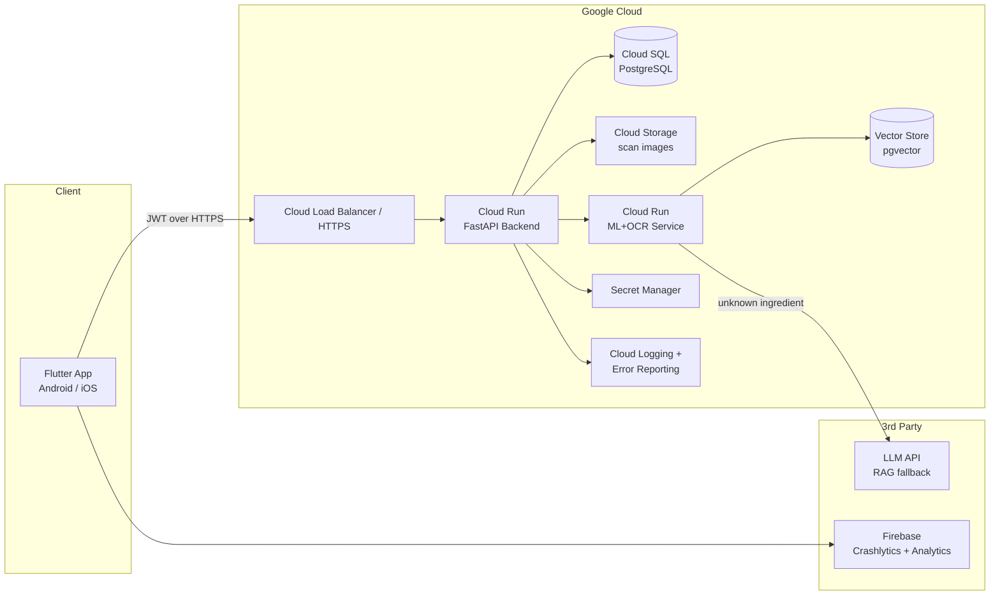
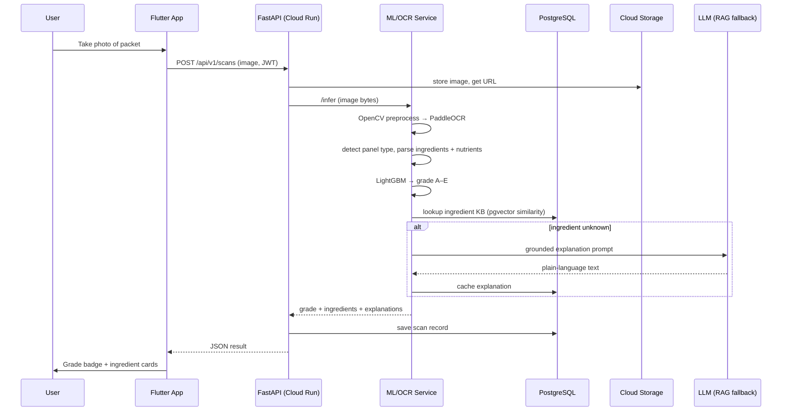
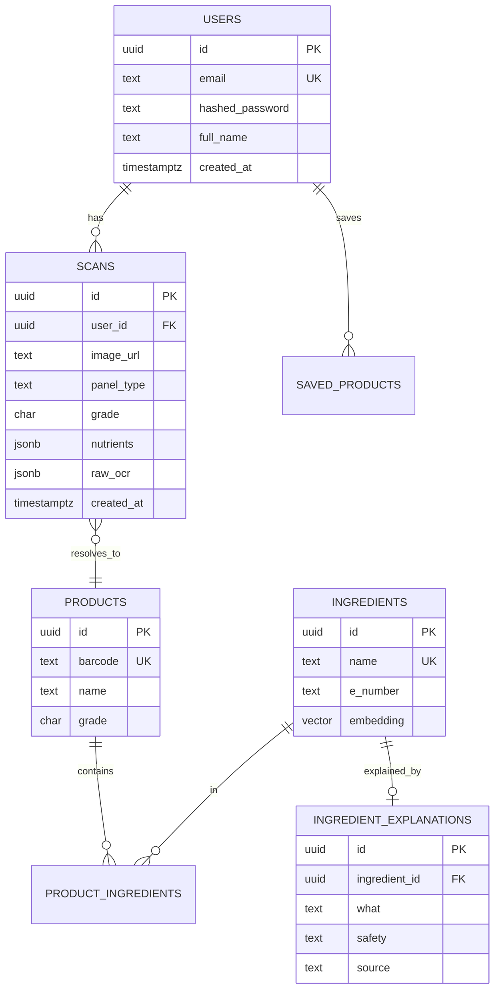
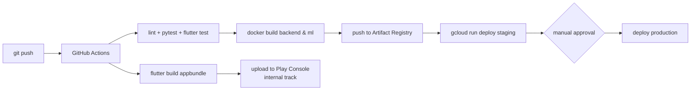

# NutriScan — Production Architecture

## 1. System Overview

NutriScan analyzes packaged food from photos. The user scans a packet; the system runs OCR,
extracts ingredients + nutrition values, predicts a Nutri-Score grade (A–E) with a trained
LightGBM model, and explains every ingredient in plain language using a knowledge base with
an LLM/RAG fallback.

## 2. High-Level Architecture



**Why each component exists**

| Component | Why |
|---|---|
| Flutter app | One codebase → Android + iOS. Camera, offline cache, Material 3. |
| Cloud Run (API) | Serverless containers: scale-to-zero (cost), autoscale on traffic, no server ops. |
| Cloud Run (ML/OCR) | OCR + model inference is CPU-heavy and has different scaling needs than the API — isolating it keeps API latency low and lets it scale independently. |
| Cloud SQL Postgres | Relational data (users, scans, products) + pgvector extension doubles as the RAG vector store, avoiding a second database bill. |
| Cloud Storage | Raw scan images don't belong in Postgres. Signed URLs keep them private. |
| Secret Manager | JWT keys, DB passwords, LLM API keys never live in code or env files. |
| Cloud Logging / Error Reporting | Centralized structured logs + automatic error grouping/alerts. |
| Firebase Crashlytics + Analytics | Client-side crash reports and usage funnels for the mobile app. |
| GitHub Actions | CI/CD: test → build → push image → deploy on every merge to main. |

## 3. Scan Request Flow



## 4. Database ERD



## 5. CI/CD



## 6. Folder Structure (top level)

```
nutriscan/
├── backend/           FastAPI + ML + OCR + RAG (single deployable, two entrypoints)
│   ├── app/
│   │   ├── api/v1/endpoints/   auth, scans, history, ingredients, admin, health
│   │   ├── core/               config, security, logging, rate limit
│   │   ├── db/                 session, base, init
│   │   ├── models/             SQLAlchemy ORM
│   │   ├── schemas/            Pydantic request/response
│   │   ├── services/
│   │   │   ├── ocr/            preprocess, engine, parsers
│   │   │   ├── ml/             model loader, predictor
│   │   │   └── rag/            embeddings, retriever, llm fallback, kb
│   │   └── utils/
│   ├── alembic/                migrations
│   ├── tests/                  unit + API tests
│   ├── scripts/                seed KB, import model assets
│   ├── ml_assets/              health_classifier.pkl, vocab, additives (from your notebook)
│   ├── Dockerfile
│   └── requirements.txt
├── mobile/            Flutter app (Riverpod, Material 3, go_router)
│   ├── lib/
│   │   ├── core/               theme, dio client, secure storage, errors, router
│   │   └── features/           auth, scan, history, dashboard, profile
│   ├── android/                signing config, manifest
│   └── test/
├── infra/
│   ├── docker/docker-compose.yml      local dev: api + ml + postgres
│   ├── gcp/cloudbuild.yaml            Cloud Build alt pipeline
│   └── scripts/deploy.sh
├── .github/workflows/             ci.yml, deploy.yml, mobile.yml
└── docs/                          this file, Play Store guide, privacy policy
```

## 7. Security

- JWT access (30 min) + refresh (30 days) tokens, bcrypt password hashing
- Rate limiting per-IP and per-user (slowapi)
- All secrets via Secret Manager / env injection — never committed
- Signed URLs for image access; bucket is private
- CORS locked to app origins; HTTPS only; security headers middleware
- Input validation on every endpoint via Pydantic; file-type + size checks on upload

## 8. Cost Optimization

- Cloud Run scale-to-zero on both services (pay only for requests)
- Single Postgres instance hosts relational + vector data
- LLM called only on KB cache miss, response cached forever after
- Images compressed client-side before upload (target < 500 KB)
- min-instances=0 for staging, 1 for prod ML service (avoids cold-start OCR model load)
